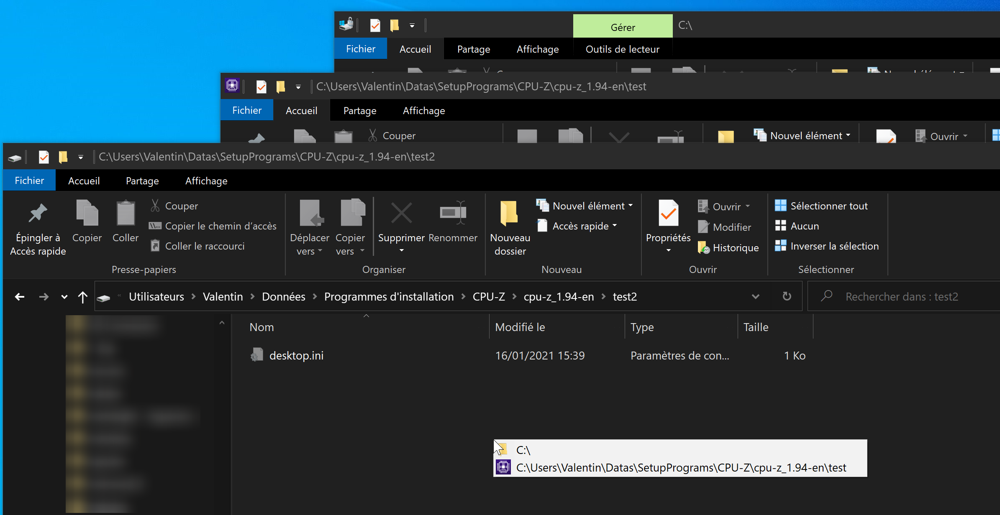
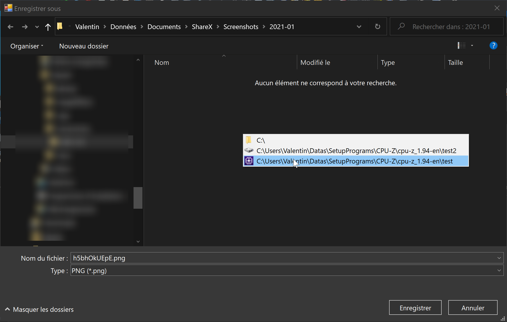
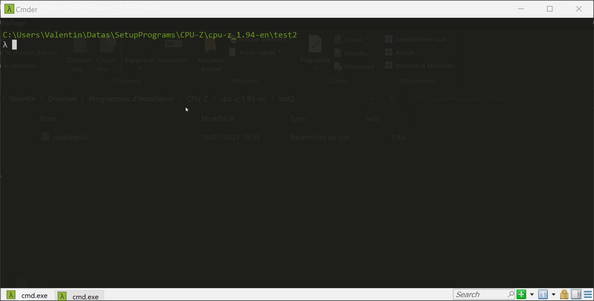
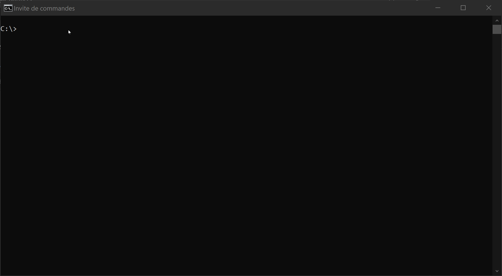

# Quick Switch Explorer

<kbd>Windows</kbd> <kbd>Enhancement</kbd> <kbd>Productivity</kbd>

Enhance **Open...**/**Save As...** dialogs, **Cmder**/**cmd**/**Windows Explorer** windows with a quick way to navigate to currently opened folders.

This AutoHotkey script is a fork of [Currently-Opened-Folders by akaleeroy](https://gist.github.com/akaleeroy/f23bd4dd2ddae63ece2582ede842b028).  
Tested on Windows 10.

## Update
- Added support of folder icons
- Added support of Windows Explorer
- Added support of Cmder

## Images

## How it works

You run the script in the background the whole time Windows is on. I included it into another script with more helper functions and compiled it to an executable which is set to start with Windows.

1. When one of these file selection dialogs pops up, <kbd>Middle Click</kbd> inside it. Or hit <kbd>Ctrl</kbd> + <kbd>G</kbd>. These are configurable at the top of the script.

2. A menu appears with your current working directories. 

3. Select one and the script will quickly insert it in the dialog's address bar and take you there. 

4. Save or select your file.

## Limitations

Special places like Computer, Libraries, Search results etc. won't show up in the menu.